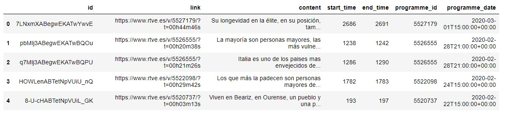

## TVE-nvejecimiento
### El envejecimiento es cosa de hoy en los informativos
Dedicados a analizar datos de ciencia y en particular del ámbito del envejecimiento, nos surgía una curiosidad. ¿Cómo tratan los servicios informativos españoles, las noticias relacionadas con envejecimiento y longevidad?, ¿Cuánto se menciona la relación de este ámbito con la ciencia?
Este análisis se antojaba cuanto menos muy complicado, más allá de tener una idea subjetiva de que el tratamiento de este tipo de noticias era escaso y casi siempre centrado en el tema de las pensiones.  

Cuando más abandonada estaba esta idea en lo más profundo del cajón, apareció en nuestro camino Civio que es una Fundación dedicada a investigar a los poderes públicos mezclando periodismo y análisis de datos a partes iguales, que ha desarrollado una herramienta denominada Verba que es un interesante proyecto de código abierto para analizar las temáticas que trata Televisión Española (TVE) en sus informativos, bajo una muy interesante idea como es la captura de todos los subtítulos de los vídeos de los telediarios de TVE y el análisis de su contenido.  

Aprovechando la generosidad y el trabajo de [Civio](https://civio.es/), retomamos la idea original capturando aquellos subtítulos de los informativos de TVE que hicieran mención sobre el envejecimiento, la longevidad y las personas mayores e intentar desarrollar un análisis más en profundidad desarrollando un tratamiento de los datos y mediante el procesamiento del lenguaje natural.  

Así comenzamos manos a la obra a capturar datos de Verba y analizar los datos mediante Python…
La fórmula de búsqueda o términos que se han buscado en los subtítulos del telediario han sido: envejecimiento | longevidad | envejec*| “personas mayores” | longev*  

Se han obtenido 784 menciones a estos términos desde finales del 2013, año en el que TVE implanto el servicio de transcripciones en sus vídeos de los informativos de tve a la carta.  

En este dataframe descargado nos indica el identificador y el enlace al vídeo de la noticia, el contenido de los subtítulos, el tiempo de inicio y fin de la noticia y la fecha en la que se emitió.  

Tras el tratamiento de los datos con la biblioteca Pandas de Python, se obtienen el tiempo que dura la noticia, la fecha, las noticias que se relacionan con la ciencia o la investigación, la sesión del telediario a la que se refiere la noticia (sesión de mediodía o de la noche), la cantidad de veces que se mencionan los términos longevidad, envejecimiento o personas mayores dentro de cada noticia, etc.  

Finalmente se realiza un procesamiento del lenguaje natural (PLN) con el campo del contenido de los subtítulos para procesar aquellas palabras clave que más se mencionan y determinar qué aspectos del envejecimiento o longevidad son más tratados en los servicios informativos.
Algunas conclusiones del análisis son:
-	Se producen más menciones a noticias sobre envejecimiento en los *telediarios de mediodía* (415 menciones) frente a las sesiones nocturnas de los telediarios (356 menciones)
-	Al contrario de los esperado, sólo un 1,18% de las noticias mencionadas se relacionan con temas de *pensiones*.
-	Sin embargo, se produce un hecho destacable y es una proporción no despreciable (casi un 8%) de menciones a noticias de envejecimiento relacionadas también con *ciencia, investigación o innovación*.
-	La serie temporal de número de menciones a diario de los términos buscados tiene su pico en el año 2015, con cerca de 17 menciones en un solo día. Se aprecia que las menciones relacionadas con ciencia o investigación muestran una ligera tendencia de crecimiento en los últimos años, destacando un pico de 5 menciones en un día en el 2019.  

-	Si analizamos las menciones por *estacionalidad anual*, se aprecia que los *meses de invierno*, se mencionan más noticias sobre los términos de estudio que los meses de verano.

-	Al darle un vistazo a la tendencia general en las menciones sobre envejecimiento, longevidad o personas mayores en los telediarios durante el periodo de estudio, sin tener en cuenta el 2013 ni el 2020 por la falta de datos completos del año, se observa una ligera *tendencia creciente* del interés en este ámbito presente en las noticias.  

-	Analizando el *tiempo de duración* o tratamiento de las noticias sobre envejecimiento, observamos que la tendencia se aprecia constante a lo largo de los años, con una duración media cercana a los 4 minutos/noticia.  

-	Procesando los textos para eliminar todas aquellas palabras sin información relevante y tratando de identificar aquellas temáticas con mayor presencia en las noticias sobre envejecimiento, se observa que en gran medida las noticias se abordan desde el *aumento de la población mayor*, realizando en gran medida una lectura de esta dinámica poblacional como un *problema de la sociedad* actual. Curiosamente un concepto que se repite con frecuencia en las noticias sobre envejecimiento son los *niños y jóvenes*, tratando estos temas desde varios ángulos: tratamiento de la información sobre niños y personas mayores como dos de las comunidades más vulnerables en la sociedad, el menor nivel de natalidad como uno de los parámetros más influyentes en el envejecimiento poblacional, desde la perspectiva del cuidado a una población con especial factor de riesgo y desde el punto de vista de las dificultades para la juventud en iniciar su vida laboral, lo que redunda en los problemas de las pensiones.  

-	Otros conceptos que tienen especial protagonista en las noticias son los aspectos relacionados con la *salud y las enfermedades* propias del envejecimiento, la calidad de vida, la soledad, el hogar y los conceptos asociados a la familia, destacando la presencia de las referencias a la mujer por encima de las referencias al hombre asociadas a las noticias sobre envejecimiento.
-	Cómo se mencionaba anteriormente, también existen referencias a conceptos entorno a la *investigación* sobre aspectos relacionados con el envejecimiento entre los que más destacan por su frecuencia de mención son los aspectos genéticos especialmente relacionados con los telómeros y las investigaciones con modelos animales como los ratones.
-	Es importante mencionar que hay aproximadamente un 4% de noticias que se refieren al envejecimiento del parque móvil español que habría que eliminar del análisis.  

-	Otro aspecto que era interesante estudiar era el análisis de los Bi-gramas y Tri-gramas, es decir aquellas expresiones de dos o tres palabras que con frecuencia aparecen siempre juntas en el contenido de las noticias y que nos pueden dar información adicional de conceptos que hayamos podido pasar por alto en el primer análisis de palabras clave. Se puede apreciar aquí, los conceptos del aumento de la *esperanza de vida* de la población y la mejora de la calidad de vida son los más recurrentes en las noticias. Otros aspectos que se muestran con cierta frecuencia son los relativos a los *problemas de la movilidad reducida* de las personas mayores, al concepto de grupo especialmente vulnerable por sus factores de riesgo y las menciones a la OMS como referente en estos aspectos. Además, es curioso que sigue siendo recurrente la asociación con niños y mujeres embarazadas.
-	Curioso también la presencia de algunos conceptos en los que las noticias se han parado a mencionar con cierta frecuencia. Entre ellas las menciones al *hombre más longevo del mundo*, el español Francisco Núñez que finalmente falleció en el año 2018 con 6 noticias relacionadas a lo largo del 2017-2018. Otras de las menciones a priori curiosas es la mención repetida de la *Guardia Civil*, relacionados con actuaciones en defensa de víctimas de delitos relacionadas con personas mayores. Y la mención de Sammy Basso, un joven con progeria, una enfermedad de envejecimiento acelerada.  

  

